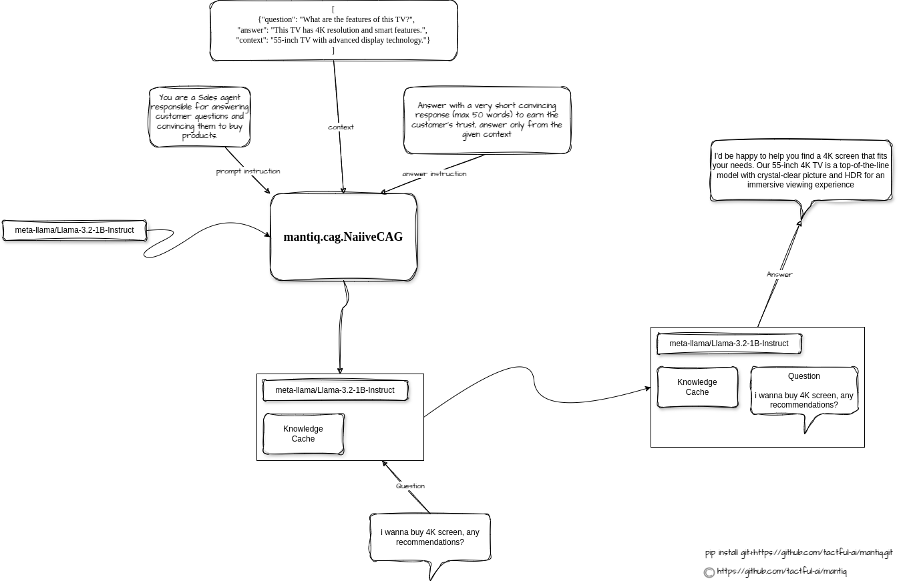

# Mantiq




Mantiq is a sophisticated package designed for dynamic knowledge caching and conversational AI. The package builds on the core principles of knowledge caching and conversational AI, streamlining the integration and processing of KV caches for enhanced language model performance.

## Features

- **Efficient KV Caching**: Create, save, and retrieve knowledge vector caches for optimized performance.
- **Customizable Prompt Instructions**: Tailor system and user instructions for specific use cases.
- **Seamless Integration**: Built on top of HuggingFace Transformers for compatibility with a wide range of models.
- **Dynamic Processing**: Parse and utilize datasets in JSON format for knowledge preparation.

## Installation

```bash
pip install git+https://github.com/tactful-ai/mantiq.git
```

## Usage

### Initializing mantiq

```python
from mantiq.cag import NaiiveCAG

# HuggingFace token
hf_token = "your_hf_token_here"

# Initialize NaiiveCAG
cag = NaiiveCAG(
    model_name="meta-llama/Llama-3.2-1B-Instruct",  # Replace with your model name
    hf_token=hf_token,
    quantized=True  # Enable quantization for performance
)

```

### Preparing the KV Cache

#### Dataset Example

```python
dataset = [
    {"question": "What are the features of this TV?", "answer": "This TV has 4K resolution and smart features.", "context": "55-inch TV with advanced display technology."},
    {"question": "Does this refrigerator save energy?", "answer": "Yes, it has an A++ energy rating.", "context": "Eco-friendly refrigerator with advanced cooling technology."},
    {"question": "What makes this washing machine special?", "answer": "It has AI-powered wash cycles for better cleaning.", "context": "Front load washing machine with AI technology."}
]
```

#### KV Cache Preparation
```python
# Define instructions
prompt_instruction = "You are a Sales agent responsible for answering customer questions and convincing them to buy products."
answer_instruction = "Answer with a very short convincing response (max 50 words) to earn the customer's trust, answer only from the given context"

# Prepare KV cache
saving_path = "./cache_directory"
kv_cache, prep_time = cag.prepare_kvcache(
    dataset=dataset,
    saving_path=saving_path,
    prompt_instruction=prompt_instruction,
    answer_instruction=answer_instruction
)
print(f"KV cache prepared in {prep_time:.2f} seconds.")

```


### Reloading KV Cache
```python
# Reload previously saved KV cache
kv_cache = cag.read_kv_cache("./cache_directory/kv_cache.pt")

```


### Generating Responses

```python
# Customer query
input_query = "i wanna buy 4K screen, any recommendations?"

# Generate response
response = cag.generate_response(
    query=input_query,
    past_key_values=kv_cache,  # KV cache prepared earlier
    max_new_tokens=100          # Maximum number of tokens for the response
)
print(response)

#  I'd be happy to help you find a 4K screen that fits your needs. Our 55-inch 4K TV is a top-of-the-line model with crystal-clear picture and HDR for an immersive viewing experience.


```

## Development Background

mantiq is part of a long-term development plan by the tactful team focusing on advancements in Conversational AI and Knowledge Caching (CAG) techniques. This work is inspired by the seminal research presented in the paper "Dynamic Knowledge Caching for Conversational AI," which you can access [here](https://arxiv.org/pdf/2412.15605).

The original repository that laid the foundation for CAG can be found [here](https://github.com/hhhuang/CAG).

## Contributing

We welcome contributions! Please follow the standard GitHub workflow:

1. Fork the repository
2. Create a feature branch
3. Commit your changes
4. Submit a pull request

## License

This project is licensed under the MIT License. See the LICENSE file for details.

---

For questions or support, feel free to open an issue in the repository.

